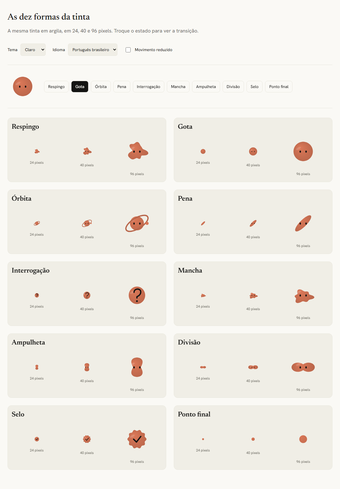
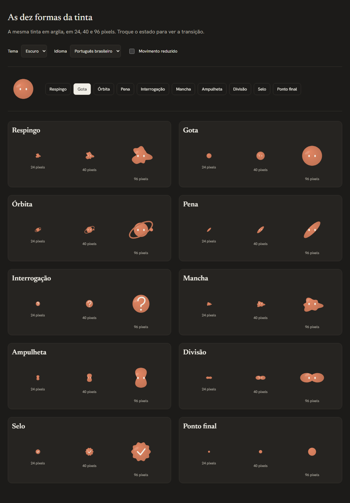
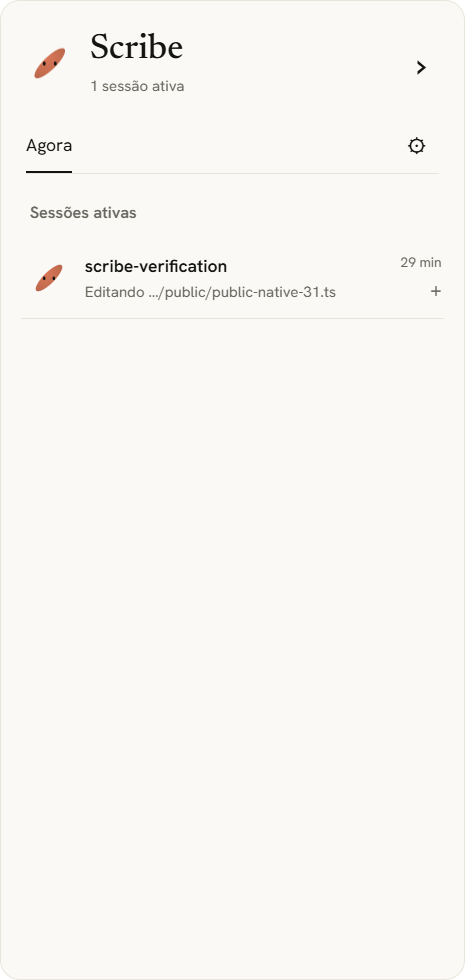

# Fase 3 — janela e gota em verificação

Data: 2026-10-06. Fases 0–2 aprovadas; esta fase ainda aguarda CI,
revisão adversarial independente e revisão visual humana. Não há release nem
fluxo de decisão nesta entrega. O PR não autoriza passar a próxima catraca.

## Entrega

Janela Tauri 2 estável, 372 px lógicos e área útil menos 32 px. Modo recolhido
de 56 px, arrastar/snap, monitor/lado/altura lembrados; bandeja e atalho global
configurável com aviso de conflito. `--open` e instância única trazem a janela.
Sessões vêm do núcleo sanitizado: projeto, ação, tempo, origem, oito passos e
concluídas. React escapa texto; nenhum token é enviado ao webview.

Temas claro/escuro/automático, pt-BR/en, fontes OFL embarcadas, dez formas
Canvas2D, transição de 450 ms, DPR e movimento reduzido. Selo e interrogação
usam glifos reconhecíveis; a divisão tem dois lóbulos e o respingo é assimétrico.
Formas estacionárias desenham nas mudanças e piscadas; órbita continua animada.
Preferências de retenção/visibilidade são atômicas no banco; falhas de gravação
de configuração fazem rollback. Ver [ADR 0008](adr/0008-janela-e-gota.md).

## Reproduzir no PowerShell 7

Executar a partir da cópia de trabalho em `D:\RexIA\projetos\scribe`, deixando
builds fora do OneDrive. Node >=24.11, Rust 1.96 e Build Tools estão disponíveis.

```powershell
cd D:\RexIA\projetos\scribe\app
npm.cmd ci --ignore-scripts
npm.cmd run lint
npm.cmd run format:check
npm.cmd run test
npm.cmd run build
npm.cmd exec -- playwright install chromium
npm.cmd run e2e
cargo fmt --manifest-path src-tauri/Cargo.toml --check
cargo clippy --manifest-path src-tauri/Cargo.toml --features desktop --locked --all-targets -- -D warnings
cargo test --manifest-path src-tauri/Cargo.toml --features desktop --locked -- --test-threads=1
cargo build --manifest-path src-tauri/Cargo.toml --release --features desktop,tauri/custom-protocol --locked --bin scribe
```

Para testar a janela, usar `SCRIBE_CONNECTION_FILE` e `SCRIBE_DATA_DIR` absolutos
sob `.artifacts/phase-3-native`, sem configuração de sessões pessoais. O primeiro
é um arquivo; o segundo é um diretório privado de histórico. A conexão/token
é criada pelo Rust. O helper usa o mesmo formato `port/token/app_path`.

O inspetor `app/ui/test/native-inspect.mjs` usa CDP local de WebView2 somente
no processo de teste (`WEBVIEW2_ADDITIONAL_BROWSER_ARGUMENTS=--remote-debugging-port=9223`).
Ele observa DOM e envia hooks públicos ao servidor isolado. Não clica nem
invoca decisões. Requer `SCRIBE_EVIDENCE_DIR` também sob `.artifacts`.
Não habilitar essa instrumentação para o app instalado de uso diário.

## Resultados locais

- 24 testes Rust do núcleo/políticas passaram, incluindo falha SQL na segunda
  política: configurações, poda, histórico e memória permanecem inalterados.
- Cinco testes de biblioteca com desktop passaram: origem/navegação,
  preferências inválidas, gravação privada, higienização e coordenadas Win32.
- Treze testes Vitest passaram: sessões, i18n, modal, histórico, prioridade,
  DPR, FPS, pausa oculta e movimento reduzido.
- Quatro Playwright passaram: teclado/foco, idiomas/temas, dez formas nos três
  tamanhos, axe WCAG A/AA em claro/escuro e limite de redesenho.
- UI build, ESLint, Prettier e Clippy desktop passaram. npm audit: zero
  vulnerabilidades. Cargo audit: dois avisos GTK avaliados publicamente em
  [dependências desktop](dependencias-desktop.md); não chamar isso de auditoria
  sem ressalvas.
- Janela Windows real abriu; configuração/Escape, expansão de sessão, atalho
  global e clique para reabrir foram observados via Computer Use. Inputs do
  servidor são fixtures públicas de teste, não sessões reais de Claude Code.
- Build de produção abriu `http://tauri.localhost/`, com fontes locais. Janela
  372×784, DPR 1,25, sem overflow. Em 32 eventos até o DOM, p95 **17,46 ms**;
  o teste inclui HTTP, gravação, ponte e renderização. Limite: 200 ms.
  A amostra final, após corrigir o desligamento do inspetor, foi **20,90 ms**.
  O inspetor encerra apenas sua conexão CDP: `browser.close()` derrubava o
  WebView2 embutido e foi removido. A janela continuou interativa após a inspeção.
- FPS de navegador sem compilação concorrente: **61** desenhos em 1 s no grande,
  até 30 nos pequenos; movimento reduzido parou todos. Sob compilação concorrente
  a primeira amostra foi 51 no grande. Limites determinísticos também têm teste.
- Recursos Windows em repouso por 15 s: processo nativo RSS **33,84 MiB**;
  app + WebView2 com **95,88 MiB de working set privado** e **1,053% CPU**
  normalizada para oito processadores lógicos. Soma bruta dos working sets
  **391,32 MiB**, incluindo páginas compartilhadas contadas em vários processos.
  As métricas estão expostas para a revisão avaliar o NFR-04; não tratar a soma
  bruta como se fosse 95,88. Primeira amostra de CPU 2,73% falhou e foi preservada;
  redesenho de geometria foi evitado e formas estacionárias passaram a desenhar
  somente quando necessário. Não medir durante compilação.

Evidências JSON: `docs/evidence/desktop-*.json`. Artefatos locais brutos estão
em `.artifacts/phase-3-*` na cópia D. Os testes não substituem os ensaios humanos
de permitir/negar/expirar e três sessões reais exigidos nas Fases 4 e 6.

## Capturas para revisão visual





As capturas do catálogo vieram de Playwright com movimento reduzido para
comparar geometria de forma determinística. A captura nativa é do WebView de
produção em escala física de DPR 1,25; dimensão lógica da janela é 372 px.

## Limites pendentes

CI em três plataformas, revisão independente, inspeção visual humana e teste
de arrastar/bandeja/conflito no Windows precisam de evidência antes da aprovação.
O arraste automatizado de (28,28) a (8,46) dentro da gota de 56 px não mudou sua
posição, inclusive após a correção das coordenadas Win32. A chamada do SDK
posta um ponteiro onde a mensagem espera coordenadas empacotadas; o caminho
Windows usa a representação documentada, mas isso ainda não demonstra arraste
funcional. Não considerar esse critério aprovado nem atribuir a falha ao teste
sem evidência adicional.
Notificações, cartões de permissão/pergunta, instaladores e site ficam nas fases
seguintes. O link de ajuda aponta para o site de documentação ainda a publicar.
Os dois avisos GTK precisam da avaliação do revisor e da auditoria da Fase 5.
