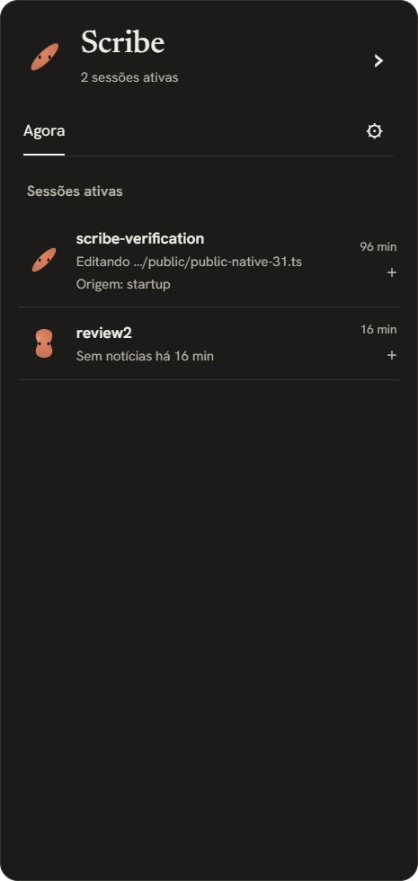

# Fase 3 — janela e gota em verificação

Data: 2026-10-06. Fases 0–2 aprovadas; esta fase ainda aguarda CI,
revisão adversarial independente e revisão visual humana. Não há release nem
fluxo de decisão nesta entrega. O PR não autoriza passar a próxima catraca.

## Entrega

Janela Tauri 2 estável, 372 px lógicos e área útil menos 32 px. Modo recolhido
de 56 px, arrastar/snap, monitor/lado/altura lembrados; bandeja e atalho global
configurável com aviso de conflito. `--open` e instância única trazem a janela.
Sessões vêm do núcleo sanitizado: projeto, ação, tempo, origem, oito passos e
concluídas. React escapa texto; nenhum token é enviado ao webview.

Temas claro/escuro/automático, pt-BR/en, fontes OFL embarcadas, dez formas
Canvas2D, transição de 450 ms, DPR e movimento reduzido. Selo e interrogação
usam glifos reconhecíveis; a divisão tem dois lóbulos e o respingo é assimétrico.
Formas estacionárias desenham nas mudanças e piscadas; órbita continua animada.
Preferências de retenção/visibilidade são atômicas no banco; falhas de gravação
de configuração fazem rollback. Ver [ADR 0008](adr/0008-janela-e-gota.md).

## Reproduzir no PowerShell 7

Executar a partir da cópia de trabalho em `D:\RexIA\projetos\scribe`, deixando
builds fora do OneDrive. Node >=24.11, Rust 1.96 e Build Tools estão disponíveis.

```powershell
cd D:\RexIA\projetos\scribe\app
npm.cmd ci --ignore-scripts
npm.cmd run lint
npm.cmd run format:check
npm.cmd run test
npm.cmd run build
npm.cmd exec -- playwright install chromium
npm.cmd run e2e
cargo fmt --manifest-path src-tauri/Cargo.toml --check
cargo clippy --manifest-path src-tauri/Cargo.toml --features desktop --locked --all-targets -- -D warnings
cargo test --manifest-path src-tauri/Cargo.toml --features desktop --locked -- --test-threads=1
cargo build --manifest-path src-tauri/Cargo.toml --release --features desktop,tauri/custom-protocol --locked --bin scribe
```

Para testar a janela, usar `SCRIBE_CONNECTION_FILE` e `SCRIBE_DATA_DIR` absolutos
sob `.artifacts/phase-3-native`, sem configuração de sessões pessoais. O primeiro
é um arquivo; o segundo é um diretório privado de histórico. A conexão/token
é criada pelo Rust. O helper usa o mesmo formato `port/token/app_path`.

O inspetor `app/ui/test/native-inspect.mjs` usa CDP local de WebView2 somente
no processo de teste (`WEBVIEW2_ADDITIONAL_BROWSER_ARGUMENTS=--remote-debugging-port=9223`).
Ele observa DOM e envia hooks públicos ao servidor isolado. Não clica nem
invoca decisões. Requer `SCRIBE_EVIDENCE_DIR` também sob `.artifacts`.
Não habilitar essa instrumentação para o app instalado de uso diário.

## Resultados locais

- 23 testes Rust do núcleo/políticas passaram, incluindo falha SQL na segunda
  política: configurações, poda, histórico e memória permanecem inalterados.
- Cinco testes de biblioteca com desktop passaram: origem/navegação,
  preferências inválidas, gravação privada, higienização e coordenadas Win32.
- Trinta e três testes Vitest passaram: sessões, i18n, modal, histórico, prioridade,
  DPR, FPS, pausa oculta, movimento reduzido, erros recolhidos e recuperação.
- Onze Playwright passaram: teclado/foco, idiomas/temas, dez formas nos três
  tamanhos, axe WCAG A/AA em claro/escuro, limite de redesenho e contraste de
  interrogação/selo em 24/40/56/96 px.
  O repouso sem olhos é medido após 6,5 s, além do prazo máximo da primeira piscada.
- UI build, ESLint, Prettier e Clippy desktop passaram. npm audit: zero
  vulnerabilidades. Cargo audit: dois avisos GTK avaliados publicamente em
  [dependências desktop](dependencias-desktop.md); não chamar isso de auditoria
  sem ressalvas.
- Janela Windows real abriu; configuração/Escape, expansão de sessão, atalho
  global e clique para reabrir foram observados via Computer Use. Inputs do
  servidor são fixtures públicas de teste, não sessões reais de Claude Code.
- Porta ocupada no formulário nativo foi rejeitada com alerta em português;
  conexão e preferências conservaram a porta anterior (7717). Evidência em
  `docs/evidence/desktop-port-conflict.json`.
- Build de produção abriu `http://tauri.localhost/`, com fontes locais. Janela
  372×784, DPR 1,25, sem overflow. Em 32 eventos até o DOM, p95 **17,46 ms**;
  o teste inclui HTTP, gravação, ponte e renderização. Limite: 200 ms.
  A amostra final, após corrigir o desligamento do inspetor, foi **20,90 ms**.
  O inspetor encerra apenas sua conexão CDP: `browser.close()` derrubava o
  WebView2 embutido e foi removido. A janela continuou interativa após a inspeção.
- FPS de navegador sem compilação concorrente: **61** desenhos em 1 s no grande,
  até 30 nos pequenos; movimento reduzido parou todos. Sob compilação concorrente
  a primeira amostra foi 51 no grande. Limites determinísticos também têm teste.
- Recursos Windows em repouso por 15 s: processo nativo RSS **33,84 MiB**;
  app + WebView2 com **95,88 MiB de working set privado** e **1,053% CPU**
  normalizada para oito processadores lógicos. Soma bruta dos working sets
  **391,32 MiB**, incluindo páginas compartilhadas contadas em vários processos.
  As métricas estão expostas para a revisão avaliar o NFR-04; não tratar a soma
  bruta como se fosse 95,88. Primeira amostra de CPU 2,73% falhou e foi preservada;
  redesenho de geometria foi evitado e formas estacionárias passaram a desenhar
  somente quando necessário. Não medir durante compilação.

Evidências JSON: `docs/evidence/desktop-*.json`. Artefatos locais brutos estão
em `.artifacts/phase-3-*` na cópia D. Os testes não substituem os ensaios humanos
de permitir/negar/expirar e três sessões reais exigidos nas Fases 4 e 6.

## Capturas para revisão visual




As capturas do catálogo vieram de Playwright com movimento reduzido para
comparar geometria de forma determinística. A captura nativa é do WebView de
produção em escala física de DPR 1,25; dimensão lógica da janela é 372 px.

## Limites pendentes

CI em três plataformas, revisão independente, inspeção visual humana e teste
de arrastar/bandeja/conflito no Windows precisam de evidência antes da aprovação.
O arraste automatizado de (28,28) a (8,46) dentro da gota de 56 px não mudou sua
posição, inclusive após a correção das coordenadas Win32. A chamada do SDK
posta um ponteiro onde a mensagem espera coordenadas empacotadas; o caminho
Windows usa a representação documentada, mas isso ainda não demonstra arraste
funcional. Não considerar esse critério aprovado nem atribuir a falha ao teste
sem evidência adicional.
Notificações, cartões de permissão/pergunta, instaladores e site ficam nas fases
seguintes. O link de ajuda aponta para o site de documentação ainda a publicar.
Os dois avisos GTK precisam da avaliação do revisor e da auditoria da Fase 5.

## Correções após a rodada 1

Rodada 1, candidato 3a12b86: reprovada (A8 B7 C8 D7 E8 F7 G8 H7 I8 J8),
com sete problemas documentados. O relatório foi preservado. Origem agora aparece
na linha compacta; revisões monotônicas ordenam as capturas; mudança de DPR
repinta o canvas estático sem animar. Falha de gravação preserva janela/DOM;
o erro específico fica disponível, e operações recuperadas limpam o alerta local.
Setas reposicionam a gota focada, Enter abre e o foco permanece visível.

Repetição nativa Windows: com preferências somente leitura, a janela ficou
372×784 e as preferências não mudaram. Após restaurar acesso, recolheu e reabriu.
Teclado moveu à esquerda (x0), para cima (y510→490 físicos, 16 px lógicos)
e à direita (x1850), persistindo lado/altura. Isso não comprova arraste por mouse.
Evidência: `docs/evidence/desktop-layout-recovery.json`.

Axe no WebView de produção claro teve zero violações WCAG A/AA em cinco
estados: recolhido, sessões, detalhe, configurações e erro. Diagnóstico
`app/ui/test/native-accessibility.mjs` observa apenas DOM do app isolado; ele
não altera a CSP nem dispara ações UI. Arquivos `docs/evidence/native-a11y-*.json`.
Esses resultados não equivalem a ensaio humano com leitor de tela ou zoom.
Os JSONs registram o tema efetivamente examinado. A conexão CDP de Playwright
aplicava emulação de tema claro ao contexto existente; ambos os inspetores agora
usam `noDefaults: true` para preservar mídia/foco do app. As amostras anteriores
continuam válidas para o tema claro declarado, sem alegação de teste nativo escuro.

O primeiro job Linux do candidato 3a12b86 falhou ao iniciar Playwright:
`webServer` procurava `package.json` em `app/ui`. O servidor Vite já aberto
mascarava essa falha localmente. Foi definido `cwd` absoluto a partir do arquivo
de configuração; quatro testes passaram com `CI=true`, sem servidor existente.
No candidato def0a08, os builds/testes passaram nos três sistemas, mas o audit
de evidências rejeitou a chave administrativa `method` de um novo JSON, reservada
ao método MCP pelo sanitizador. O campo foi renomeado para `observationMethod`;
a auditoria local voltou a zero mudanças, sem relaxar o sanitizador.

## Correções após a rodada 2

Rodada 2, candidato 18ebdea: reprovada (A8 B8 C8 D8 E8 F8 G8 H7 I8 J8),
com cinco problemas documentados; relatório preservado. A gota recolhida agora
mostra um indicador de erro e anuncia a causa específica com `role=alert`.
Uma captura nova sem erro nativo limpa o alerta local, inclusive após recuperação
por atalho global. Capturas que ainda contêm erro nativo preservam o aviso.
A dica de cinco minutos acompanha hooks posteriores à abertura; sessões
restauradas não contam, e remover uma sessão recebida não apaga essa informação.

Glifos informativos usam tinta escura `#141413` sobre argila em ambos os temas,
com token separado do texto geral. A menor relação nominal considerando corpo
e borda do gradiente foi **4,39:1 no claro** e **4,98:1 no escuro**. O teste do
renderer real em Chromium também encontrou pixels centrais com relação maior
que 3:1 nos dois glifos e nos quatro tamanhos. Isso mede cores nominais e
amostras centrais, não exige 3:1 de cada pixel antialiasado. Artefatos:
`docs/evidence/glyph-contrast-{light,dark}.json`. A identidade argila é mantida;
a mudança de token é fundamentada no ADR 0008.

Os inspetores agora preservam mídia/foco do WebView (`noDefaults:true`) e
registram o tema efetivamente observado no nome das novas amostras axe.
As cinco amostras anteriores são claras; a errata mantém sua autoria e resultado.
Essas correções e os testes locais ainda não representam aprovação da catraca.

Repetição nativa após essas correções: preferências somente leitura impediram
movimento por seta, preservando 56×56 e exibindo a causa de configuração no
badge, descrição e anúncio. Após restaurar acesso e abrir pelo atalho global,
a janela voltou a 372×784 sem alerta residual. Arquivos de teste ficaram
novamente graváveis. Evidências `desktop-collapsed-error.json` e
`desktop-shortcut-recovery.json`. Axe nativo escuro teve zero violações em
sessões e nesse estado de erro; isso continua sem avaliar pixels do canvas.

A nova amostra de 32 hooks públicos em produção, preservando tema escuro,
registrou p95 **23,46 ms**, DPR 1,25 e 372×784 sem overflow; evidência
`desktop-native-round3.json`. Os resultados anteriores permanecem históricos.

## Correções após a rodada 3

Rodada 3, candidato b26bc89: reprovada (A–J 8, mínimas G/H 9), com três
problemas baixos; relatório preservado. Trocar o modo transfere o foco DOM
ao controle equivalente, sem repetir esse foco a cada captura. O modal mantém
seu próprio gerenciamento. Em produção, Enter recolheu e reabriu sem outro Tab:
`desktop-focus-collapse.json` e `desktop-focus-expand.json`. Recolher pelo atalho
enquanto a Calculadora tinha foco manteve `document.hasFocus()=false` no Scribe,
com o botão interno preparado; `desktop-focus-external.json`.

O retorno de repouso agora considera se há olhos: interrogação/selo/ponto e
formas pequenas sem olhos não despertam para uma piscada impossível. As formas
com olhos continuam piscando e a órbita continua animada. O E2E espera 6,5 s e
mede mais 1,1 s: quinze variantes relevantes ficaram em **zero redraws**;
`browser-settled-forms.json`. Não confundir isso com ausência total de RAF.
O recheck do harness independente R3 passou **39/39** no candidato corrigido
(28 testes de produto e 11 adversariais), sem reescrever o log da reprovação.

O job dependency-audit instala o lockfile sem scripts e executa
`npm audit --audit-level=low`, incluindo dependências de desenvolvimento.
Nenhum `continue-on-error` é usado. O mesmo comando local teve zero
vulnerabilidades; o CI do novo candidato ainda precisa passar. Os testes,
builds e correções não dispensam o aceite visual e a confirmação do arraste.

## Correções após a rodada 4

Rodada 4, candidato f3cacc2: reprovada (A–J 8, mínimas G/H 9), com um
defeito baixo e os aceites humanos pendentes. O relatório permanece preservado.
Fechar o modal depois de recolher/reabrir agora restaura o botão Configurações
atual quando o opener original foi removido ou era BODY. O fallback é capturado
na montagem do modal e recebe foco somente enquanto ainda estiver conectado.
O recheck do harness R4 passou **38/38** (29 produto + nove adversariais), e a
reprodução independente em Chromium com proxy de snapshots passou **1/1**.
Seu resultado novo é separado do log vermelho original em
`desktop-modal-focus-browser.json`; isso não é ensaio nativo nem aceite humano.

Repetição posterior no Windows de produção: abrir Configurações, recolher e
reabrir pelo atalho global e fechar por Escape devolveu o foco ao botão
Configurações. Janela ficou 372×784, escura, sem modal/alerta e arquivo de
preferências gravável; `desktop-modal-focus-native.json`. Este ensaio do
implementador é separado da reprodução de navegador feita pelo revisor.

## Correções após a rodada 5

Rodada 5, candidato e98bd21: reprovada (A–J 8, mínimas G/H 9), com um
defeito baixo de foco ao abrir/cancelar a confirmação de histórico. O relatório
e seus logs vermelhos permanecem preservados. A troca do conteúdo agora move
o foco para Cancelar ao abrir e para Apagar histórico ao voltar. A abertura
inicial do modal e capturas sem essa troca não refocam o controle de histórico.
Os testes de produto passaram: 31 Vitest e oito Playwright. O novo E2E percorre
três ciclos de abrir/cancelar pelo teclado, verificando o foco e seu contorno
visível, sem executar limpeza. O teste de sucesso usa somente a ponte simulada.
O recheck R5 passou 39/39 (31 produto + oito adversariais), e suas duas
reproduções Chromium passaram 2/2. Logs novos do implementador ficam em
`D:/RexIA/projetos/scribe/app/.artifacts/phase-3-history-fix`, separados dos
originais da revisão.

A janela Windows em execução continua no candidato e98bd21, reservada ao
arraste humano; esta correção ainda não foi observada em um novo binário nativo.
CI desse candidato anterior terminou verde nos três sistemas; isso não aprova
o candidato corrigido nem substitui os aceites visual/arraste pendentes.

## Correções após a rodada 6

Rodada 6, candidato 41194b9: reprovada (A–J 8, mínimas G/H 9), com um
defeito baixo de foco após falha assíncrona na limpeza. Logs e relatório
permanecem preservados. O controle que iniciou uma ação é registrado antes
de ficar desabilitado. Ao terminar a espera, ele recupera foco somente se
o foco ficou no BODY e o controle ainda está conectado. Navegação posterior,
retorno de sucesso e modais desmontados mantêm seu próprio foco.

Limpeza e salvamento usam esse mesmo caminho. As duas regressões novas de
navegador falharam no 41194b9 antes da correção, com traces preservados em
`D:/RexIA/projetos/scribe/app/.artifacts/phase-3-async-focus-fix/baseline-results`.
No código corrigido, 32 Vitest, dez Playwright, lint, formatação e build UI
passaram. O teste de falha usa somente uma ponte simulada no Chromium, sem
apagar histórico nem salvar preferências nativas. Verifica tanto foco perdido
quanto foco movido para outro controle durante a espera.
O recheck do harness R6 passou 39/39 (32 produto + sete adversariais), e
seus quatro ensaios de navegador passaram 4/4, com logs novos do implementador
em `D:/RexIA/projetos/scribe/app/.artifacts/phase-3-async-focus-fix`.

CI do 41194b9 terminou verde nos três sistemas. A janela Windows permanece
no e98bd21 para o ensaio humano; essas regressões ainda não foram repetidas
em um novo binário nativo. Revisão do novo candidato e aceites humanos
continuam necessários antes de avançar.

## Correções após a rodada 7

Rodada 7, candidato 3d8c6a9: reprovada (A–J 8, mínimas G/H 9), com um
defeito baixo: um salvamento pendente de modal desmontado fechava o novo
editor e descartava seu rascunho. O modal agora registra sua montagem; sucesso
do salvamento só fecha a instância ainda montada. A preferência efetivamente
salva continua chegando ao App com sua revisão, preservando o rascunho novo.

Os testes novos Vitest/Chromium falharam no candidato anterior e passaram
com a correção. Produto: 33 Vitest e onze Playwright, lint, formatação e build
UI passaram. Recheck R7: oito ensaios válidos passaram; o caso de Tab com
expectativa corrigida e seu controle HTML mínimo passaram 2/2 separadamente.
Logs originais da revisão não foram alterados. Artefatos novos do implementador:
`D:/RexIA/projetos/scribe/app/.artifacts/phase-3-modal-save-fix`.

O CI do 3d8c6a9 falhou em latência Rust: Windows p95 604 ms no teste serial e
Linux p95 377 ms na execução instrumentada de cobertura, com testes paralelos.
O limite de 200 ms foi mantido. A cobertura agora usa `--test-threads=1`,
como a execução principal, mantendo a catraca de 85% e todas as asserções.
Isso alinha o isolamento dos testes; não comprova a causa do atraso Windows.
Foi solicitada uma reexecução dos jobs falhos do SHA anterior para observar
recorrência, sem descartar seus logs nem atribuir a falha ao ambiente sem prova.
O novo candidato ainda precisa de CI e revisão aprovados, além dos aceites
humanos. A janela nativa antiga permanece reservada ao arraste manual.

## Rodada 8 e estado atual

Revisão independente do 9b64918: A8 B8 C8 D8 E8 F8 G8 H9 I8 J8.
Nenhum defeito novo confirmado; oito tentativas adversariais válidas passaram.
O seletor inicial de R8-07 não acompanhava a tradução para inglês; controle
com seletor corrigido passou, mantendo o log e o trace iniciais. G9 continua
pendente do aceite visual humano e da demonstração do arraste físico. A fase
não está aprovada; não há fundamento para repetir revisão técnica idêntica
enquanto apenas essas evidências externas faltarem.

A reexecução do CI 3d8c6a9, attempt 2, terminou verde: p95 Windows 22 ms e
Linux 2 ms no teste serial, com 92,05% de linhas na cobertura do núcleo.
Os logs vermelhos da primeira execução foram preservados; a causa da variação
Windows não foi determinada. Isso não substitui CI do candidato mais recente.

O release Windows do 9b64918 foi compilado novamente no PC e reaberto no
servidor de teste isolado. Observação somente de leitura confirmou 372×784,
escuro, pt-BR, sem alertas, preferências graváveis e zero violações axe A/AA.
Evidências `desktop-current-startup.json`, `native-a11y-current.json` e
`native-current.png`. Esse ensaio confirma inicialização do binário atual;
não simula aceite humano nem prova o arraste e todas as corridas assíncronas.

## Integração real no PowerShell do PC

Em 2026-10-06, Claude Code 2.1.289 autenticado pela assinatura executou dois
ensaios contra o release Windows 9b64918 aberto: ciclo `--init-only` e conversa
em modo `auto`, limitada a uma leitura de `PUBLIC-TEST.txt` no diretório de
teste. O cliente nativo de produção recebeu os hooks copiados do manifesto
por `--settings`, somente nesses processos, com a conexão isolada do app.
O ensaio não instalou o plug-in nem alterou a configuração da sessão pessoal.

Ambos terminaram com código zero e stderr vazio. O ciclo persistiu dois passos;
a conversa persistiu seis passos, incluindo Read, e devolveu a linha pública
esperada. As duas sessões chegaram a `selo`, com término registrado, e apareceram
na interface nativa. A observação registrou respingo, órbita e gota durante o
turno; não mediu p95 entre disparo de hook e renderização. As três sessões antigas
na captura continuam sendo fixtures sintéticas; as quatro concluídas `workspace`
vieram das duas tentativas reais, incluindo a tentativa inicial.

O primeiro coletor interpretou incorretamente o JSON do CLI como objeto, quando
era um array, e falhou na asserção da resposta final. Sua evidência foi preservada.
Após normalizar o último elemento do array, os dois ensaios passaram. Evidências:
`docs/evidence/native-claude-real.json`,
`docs/evidence/native-claude-first-instrumentation-error.json` e
`docs/public/phase-3/native-real-claude.png`. Instrumento e logs locais em
`D:/RexIA/projetos/scribe/app/.artifacts/phase-3-claude-live`.

A janela Windows Terminal indicada pelo humano existia, mas não era exposta
pelo controle de janelas. Foram usados processos separados via PowerShell;
a sessão interativa aberta não foi controlada. Este teste comprova o caminho
Claude real → cliente nativo → servidor → interface para observação de sessão.
Não comprova instalação nessa sessão, decisões de permissão, aceite visual ou
arraste físico. A catraca da Fase 3 continua pendente.

## Instalação local autorizada pelo humano

O pedido de 2026-10-07 autoriza instalar agora e resolver o visual depois.
O app e o cliente foram copiados para `%LOCALAPPDATA%\Scribe`; há atalho no
menu Iniciar. O marketplace local e `scribe@rexia-scribe` foram instalados no
escopo de usuário pelo CLI, com as três opções configuradas. O token sensível
não está em settings.json. O app usa perfil padrão, sem fixtures sintéticas.
O ADR 0009 registra a exceção de prioridade sem transformar G8 em aprovação.

Ciclo real do plug-in instalado e conversa auto com Read passaram: código zero,
stderr vazio, resposta pública correta e sessão concluída persistida. Um teste
mais amplo chamou `scribe_report` e persistiu o marco público, mas não concluiu
a conversa; não é contado como ensaio completo aprovado. O teste seguinte de
Read foi interrompido por `error_max_budget_usd` com teto 0,50; com teto 3,00,
o ciclo/Read passaram. Tentativas originais permanecem no artefato local.

O ensaio de abertura reproduziu retenção dos canais herdados. A regressão
falhou no cliente anterior e após redirecionar apenas para null. Depois de
remover a herança dos handles padrão no Windows, 19 testes Node, um Rust,
Clippy, formatação e build de release passaram. O cliente corrigido foi copiado
para a instalação; a janela desktop permanece com o código 9b64918.

Com o app efetivamente fechado, `--init-only` terminou sem stdout/stderr; o
helper reabriu o app e encerrou em 48 ms. A conexão persistiu e o health retornou
200. O ciclo inteiro do Claude levou 2558 ms, incluindo inicialização do CLI;
este ensaio não comprova sozinho o limite de atraso adicional de FR-03 nem
o fluxo humano de PermissionRequest. Os testes do cliente verificam o prazo
individual dos hooks e a falha silenciosa. Não há aprovação automática.

Evidências: `docs/evidence/installed-preview.json`,
`installed-preview-fail-safe.json` e `installed-preview-installation.json`.
Logs/instrumentos em `D:/RexIA/projetos/scribe/app/.artifacts/installed-preview`.
O CI 90e6e27 foi verde nas três plataformas; a correção nova requer seus checks.
Cartões/perguntas/notificações, auditoria e release continuam pendentes.

Revisão independente focada em `docs/reviews/instalacao-local.md`: nenhum
bloqueador de lançamento Windows confirmado; oito sondagens e cinco repetições
passaram, com controle que reproduziu o defeito sem a proteção dos handles.
Duas lacunas baixas no teste foram tratadas: compilação com deadline/limpeza e
fixture que verifica EOF vazio, stdin aberto e sentinelas de stdout/stderr
suprimidas. Os 19 ensaios passaram novamente. Isso não é uma nova aprovação
global da Fase 3 ou da v0.1; os relatórios anteriores foram preservados.
O recheck independente em `docs/reviews/instalacao-local-recheck.md` confirmou
as duas correções: regressão 1/1 e compilador sintético encerrado aos 30 s,
com falha esperada e sem processo remanescente. Não houve achado novo no escopo.
